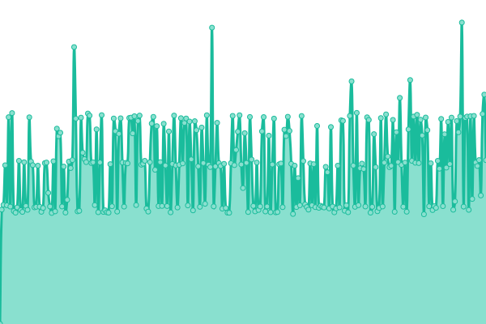
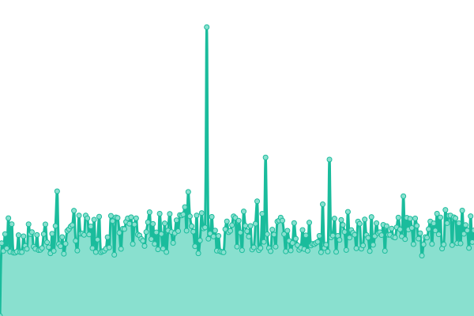
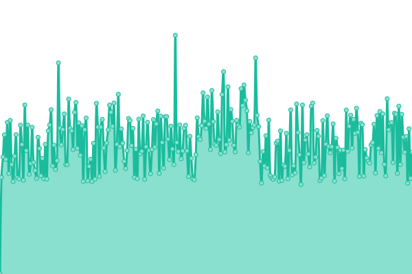
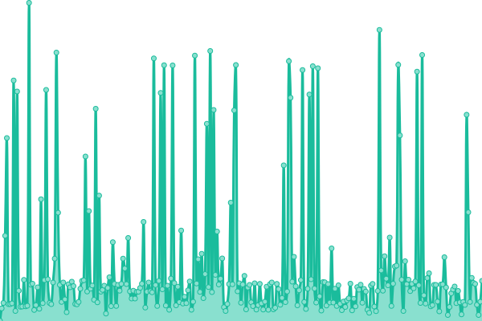

# [📈 Live Status](https://appdesign1987.github.io/uptimesite): <!--live status--> **🟩 All systems operational**

This repository contains the open-source uptime monitor and status page for [appdesign1987](https://appdesign1987.github.io/uptimesite), powered by [Upptime](https://github.com/upptime/upptime).

<!--start: status pages-->
<!-- This summary is generated by Upptime (https://github.com/upptime/upptime) -->
<!-- Do not edit this manually, your changes will be overwritten -->
<!-- prettier-ignore -->
| URL | Status | History | Response Time | Uptime |
| --- | ------ | ------- | ------------- | ------ |
|  [Nedcomp.nl](https://www.nedcomp.nl) | 🟩 Up | [nedcomp-nl.yml](https://github.com/appdesign1987/uptimesite/commits/HEAD/history/nedcomp-nl.yml) | 

 1612ms
     
 | 

<a href="https://appdesign1987.github.io/uptimesite/history/nedcomp-nl">100.00%</a>
    

|  [drv.nl](https://drv.nl) | 🟩 Up | [drv-nl.yml](https://github.com/appdesign1987/uptimesite/commits/HEAD/history/drv-nl.yml) | 

 2316ms
     
 | 

<a href="https://appdesign1987.github.io/uptimesite/history/drv-nl">99.45%</a>
    

|  [werkenbijdrv.nl](https://werkenbijdrv.nl) | 🟩 Up | [werkenbijdrv-nl.yml](https://github.com/appdesign1987/uptimesite/commits/HEAD/history/werkenbijdrv-nl.yml) | 

 2021ms
     
 | 

<a href="https://appdesign1987.github.io/uptimesite/history/werkenbijdrv-nl">99.21%</a>
    

|  [Jeroenvd.nl](https://jeroenvd.nl) | 🟩 Up | [jeroenvd-nl.yml](https://github.com/appdesign1987/uptimesite/commits/HEAD/history/jeroenvd-nl.yml) | 

 325ms
     
 | 

<a href="https://appdesign1987.github.io/uptimesite/history/jeroenvd-nl">100.00%</a>
    

<!--end: status pages-->

## 📄 License

- Powered by: [Upptime](https://github.com/upptime/upptime)
- Code: [MIT](./LICENSE) © [appdesign1987](https://appdesign1987.github.io/uptimesite)
- Data in the `./history` directory: [Open Database License](https://opendatacommons.org/licenses/odbl/1-0/)
